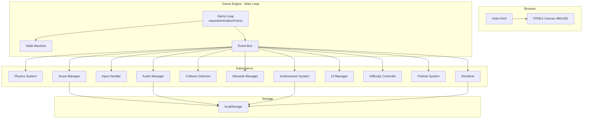
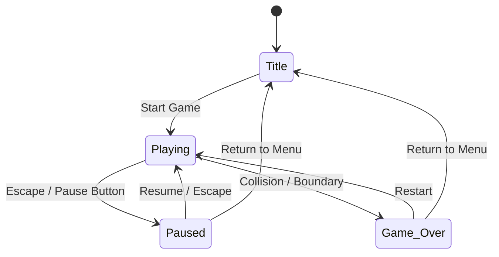

# Design Document: Flappy Kiro

## Overview

Flappy Kiro is a browser-based retro arcade game built entirely with vanilla JavaScript and HTML5 Canvas. The player controls a ghost character (Kiro) that navigates through an endless side-scrolling haunted world filled with obstacles. The game features physics-based movement, procedural obstacle generation, progressive difficulty, retro pixel-art visuals with CRT post-processing, chiptune audio, and persistent player data.

The architecture follows a modular game engine pattern with clearly separated subsystems communicating through a central event bus. The game loop uses a fixed-timestep update with interpolated rendering to ensure smooth, frame-rate-independent gameplay. All game state is managed through a finite state machine with four states: Title, Playing, Paused, and Game_Over.

### Key Design Decisions

1. **No build tools or external dependencies** — The game loads from static files in the browser. All code is vanilla ES6+ modules loaded via `<script type="module">`.
2. **Fixed-timestep physics with render interpolation** — Physics updates at a fixed rate (60Hz) while rendering interpolates positions for smooth visuals at any display refresh rate.
3. **Event bus for decoupled communication** — Subsystems publish/subscribe to events rather than holding direct references to each other's internals.
4. **Object pooling for obstacles** — Pre-allocated pools avoid garbage collection pauses during gameplay.
5. **Web Audio API for sound** — Provides low-latency audio with volume control and concurrent playback.
6. **Canvas 2D rendering at logical resolution** — Game renders at 480×320 logical pixels, scaled with nearest-neighbor interpolation to preserve pixel art.

---

## Architecture

### High-Level Architecture Diagram



### Game State Machine



### Game Loop Architecture

The game loop follows a fixed-timestep update with variable rendering:

```
┌─────────────────────────────────────────┐
│         requestAnimationFrame           │
├─────────────────────────────────────────┤
│ 1. Calculate deltaTime (capped at 50ms) │
│ 2. Accumulate time                      │
│ 3. While accumulated >= FIXED_STEP:     │
│    ├─ Input processing                  │
│    ├─ Physics update                    │
│    ├─ Collision detection               │
│    ├─ Obstacle management               │
│    ├─ Score evaluation                  │
│    ├─ Difficulty adjustment             │
│    └─ Subtract FIXED_STEP              │
│ 4. Calculate interpolation factor       │
│ 5. Render (with interpolation)          │
│    ├─ Background layers (parallax)      │
│    ├─ Clouds (back-to-front)            │
│    ├─ Obstacles                         │
│    ├─ Particles                         │
│    ├─ Kiro (interpolated position)      │
│    ├─ UI / HUD                          │
│    └─ Post-processing (CRT if enabled)  │
└─────────────────────────────────────────┘
```

---

## Components and Interfaces

### Module Structure

```
src/
├── index.html
├── main.js                  # Entry point, bootstraps GameEngine
├── engine/
│   ├── GameEngine.js        # Main loop, state machine, subsystem coordination
│   ├── EventBus.js          # Publish/subscribe event system
│   └── StateMachine.js      # FSM with state transitions
├── systems/
│   ├── PhysicsSystem.js     # Gravity, impulse, drag, velocity clamping
│   ├── InputHandler.js      # Keyboard, mouse, touch normalization
│   ├── CollisionDetector.js # AABB/sweep collision detection
│   ├── ObstacleManager.js   # Obstacle spawning, pooling, recycling
│   ├── ScoreManager.js      # Score tracking, combos, persistence
│   ├── DifficultyController.js # Progressive difficulty scaling
│   ├── AudioManager.js      # Web Audio API, sound effects, music
│   ├── AchievementSystem.js # Milestone tracking and persistence
│   └── ParticleSystem.js    # Ambient, trail, collision particles, clouds
├── rendering/
│   ├── Renderer.js          # Canvas drawing orchestration
│   ├── Background.js        # Parallax background layers + atmosphere
│   ├── CRTEffect.js         # Post-processing scanlines + vignette
│   ├── UIManager.js         # Menus, overlays, HUD, animations
│   └── SpriteSheet.js       # Sprite loading and frame management
├── entities/
│   ├── Kiro.js              # Player character state and animations
│   ├── Obstacle.js          # Single obstacle pair entity
│   └── Particle.js          # Individual particle entity
├── config/
│   └── GameConfig.js        # All tunable constants and parameters
└── utils/
    ├── ObjectPool.js        # Generic object pool implementation
    ├── MathUtils.js         # Lerp, clamp, random range utilities
    └── StorageManager.js    # localStorage wrapper with fallback
```

### Key Interfaces

#### EventBus

```javascript
class EventBus {
  on(event, callback)           // Subscribe to event
  off(event, callback)          // Unsubscribe from event
  emit(event, data)             // Publish event to all subscribers
}
```

**Events:**
- `state:change` — `{ from, to }` — State machine transition
- `input:flap` — `{}` — Player triggered a flap
- `physics:update` — `{ position, velocity }` — Kiro position updated
- `collision:obstacle` — `{ obstacle, point, velocity }` — Hit an obstacle
- `collision:boundary` — `{ boundary }` — Hit top/bottom boundary
- `score:increment` — `{ score, combo }` — Score increased
- `score:combo-milestone` — `{ streak }` — Combo milestone reached
- `difficulty:update` — `{ speed, gap, spacing }` — Difficulty changed
- `achievement:unlocked` — `{ achievement }` — New achievement earned
- `audio:play` — `{ sound }` — Request sound playback
- `rare:event` — `{ type }` — Rare visual event triggered

#### GameEngine

```javascript
class GameEngine {
  constructor(canvas, config)
  init()                        // Initialize all subsystems
  start()                       // Begin game loop
  transitionTo(state)           // Request state change
  getState()                    // Current FSM state
  reset()                       // Reset all subsystems to initial state
}
```

#### PhysicsSystem

```javascript
class PhysicsSystem {
  constructor(config, eventBus)
  update(deltaTime)             // Apply gravity, drag, update position
  applyImpulse()                // Apply flap impulse
  getPosition()                 // Current position { x, y }
  getVelocity()                 // Current velocity { vx, vy }
  getInterpolatedPosition(alpha) // Interpolated render position
  reset()                       // Reset to starting position/velocity
}
```

#### CollisionDetector

```javascript
class CollisionDetector {
  constructor(config, eventBus)
  check(kiro, obstacles)        // Check all collisions this frame
  checkBoundary(kiro)           // Check boundary violations
  setInvincible(frames)         // Set invincibility (future use)
}
```

#### ObstacleManager

```javascript
class ObstacleManager {
  constructor(config, eventBus, pool)
  update(deltaTime, speed)      // Move obstacles, spawn new, recycle old
  getActiveObstacles()          // List of active obstacle entities
  reset()                       // Clear all and reset pool
}
```

#### ScoreManager

```javascript
class ScoreManager {
  constructor(config, eventBus, storage)
  checkPass(kiroX, obstacles)   // Check if Kiro passed an obstacle
  getScore()                    // Current score
  getHighScore()                // Persisted high score
  getComboStreak()              // Current combo count
  reset()                       // Reset score and combo to zero
}
```

#### DifficultyController

```javascript
class DifficultyController {
  constructor(config)
  update(score)                 // Recalculate difficulty params from score
  getScrollSpeed()              // Current scroll speed
  getGapSize()                  // Current obstacle gap size
  getSpacing()                  // Current horizontal spacing
  reset()                       // Reset to base difficulty
}
```

#### AudioManager

```javascript
class AudioManager {
  constructor(config, eventBus, storage)
  init()                        // Create AudioContext, load sounds
  play(soundName)               // Play a sound effect
  startMusic()                  // Start/resume background music
  stopMusic()                   // Stop background music
  pauseMusic()                  // Suspend music (pause state)
  resumeMusic()                 // Resume music from pause point
  setMusicVolume(level)         // 0.0 - 1.0
  setSFXVolume(level)           // 0.0 - 1.0
  toggleMute()                  // Toggle all audio
  isMuted()                     // Current mute state
}
```

#### ParticleSystem

```javascript
class ParticleSystem {
  constructor(config, eventBus)
  update(deltaTime)             // Update all active particles
  emitTrail(position)           // Emit trail particles behind Kiro
  emitCollision(point, count)   // Emit burst at collision point
  emitAmbient()                 // Spawn ambient floating particles
  updateClouds(deltaTime)       // Update layered cloud system
  render(ctx, layer)            // Draw particles for a specific z-layer
  reset()                       // Clear all particles
}
```

#### UIManager

```javascript
class UIManager {
  constructor(config, eventBus, canvas)
  renderHUD(ctx, score, combo)  // Draw score, combo, pause button
  renderTitleScreen(ctx)        // Draw title screen elements
  renderGameOver(ctx, stats)    // Draw game over overlay
  renderPauseOverlay(ctx)       // Draw pause menu
  renderAchievement(ctx, ach)   // Draw achievement notification
  handleClick(x, y)             // Process UI button clicks
  update(deltaTime)             // Update animations/transitions
}
```

---

## Data Models

### Kiro (Player Entity)

```javascript
{
  x: number,                    // Horizontal position (fixed during gameplay)
  y: number,                    // Vertical position (updated by physics)
  prevY: number,                // Previous frame Y (for interpolation)
  vy: number,                   // Vertical velocity
  width: number,                // Sprite width in logical pixels
  height: number,               // Sprite height in logical pixels
  hitbox: {                     // Collision hitbox (smaller than sprite)
    offsetX: number,
    offsetY: number,
    width: number,
    height: number
  },
  rotation: number,             // Current rotation angle (degrees)
  animState: string,            // 'idle' | 'flap' | 'fall' | 'death'
  animTimer: number,            // Animation elapsed time
  squashStretch: { sx, sy },    // Current squash/stretch scale factors
  glowIntensity: number,       // Current glow amount (0-1)
  isAlive: boolean
}
```

### Obstacle

```javascript
{
  x: number,                    // Horizontal position (scrolls left)
  gapCenterY: number,           // Center Y of the gap
  gapSize: number,              // Total gap height
  topHeight: number,            // Height of top obstacle
  bottomY: number,              // Y start of bottom obstacle
  bottomHeight: number,         // Height of bottom obstacle
  hitboxTop: { x, y, w, h },   // Top obstacle collision rect
  hitboxBottom: { x, y, w, h },// Bottom obstacle collision rect
  width: number,                // Obstacle width in logical pixels
  passed: boolean,              // Whether Kiro has passed this pair
  scored: boolean,              // Whether score was awarded
  variant: number,              // Visual variation index
  active: boolean               // Whether currently in play
}
```

### Particle

```javascript
{
  x: number,
  y: number,
  vx: number,
  vy: number,
  life: number,                 // Remaining life (0-1)
  maxLife: number,              // Total lifespan in seconds
  size: number,
  opacity: number,
  color: string,
  type: string,                 // 'trail' | 'collision' | 'ambient' | 'cloud'
  layer: number,                // Z-layer for rendering order
  scale: number,                // Size multiplier (for clouds)
  active: boolean
}
```

### GameConfig

```javascript
{
  canvas: { width: 480, height: 320 },
  physics: {
    gravity: 980,               // pixels/sec²
    flapImpulse: -280,          // pixels/sec (upward)
    drag: 0.5,                  // drag coefficient
    terminalVelocity: 600,      // max downward speed px/sec
    maxUpwardSpeed: -400,       // max upward speed px/sec
  },
  obstacles: {
    width: 48,                  // obstacle width in px
    baseGapSize: 100,           // starting gap size in px
    minGapSize: 60,             // minimum gap (1.5x Kiro height)
    baseSpacing: 200,           // horizontal distance between pairs
    marginPercent: 0.1,         // top/bottom margin for gap placement
  },
  difficulty: {
    baseSpeed: 120,             // starting scroll speed px/sec
    maxSpeed: 240,              // maximum scroll speed (2x base)
    maxScoreThreshold: 100,     // score at which max difficulty reached
    minSpacing: 140,            // minimum horizontal spacing at max difficulty
    maxSpeedChangePercent: 0.05,// max per-increment speed change
    minReactionTime: 400,       // ms minimum between required inputs
  },
  scoring: {
    comboMilestone: 5,          // combo bonus every N passes
  },
  kiro: {
    width: 32,
    height: 32,
    hitboxScale: 0.75,          // hitbox is 75% of sprite size
    startXPercent: 0.25,        // starting X as % of canvas width
  },
  rendering: {
    backgroundPhases: ['day', 'dusk', 'night', 'haunted'],
    phaseDuration: 45,          // seconds per phase
    transitionDuration: 7,      // seconds for color interpolation
    maxParticles: 50,
    trailParticlesPerFrame: 3,
    screenShakeDuration: 400,   // ms
    deathAnimDuration: 750,     // ms
  },
  clouds: {
    layers: 3,
    distantScale: 0.5,
    distantOpacity: [0.15, 0.35],
    distantSpeedFactor: 0.5,
    midOpacity: [0.35, 0.6],
    foregroundScale: 1.5,
    foregroundOpacity: [0.6, 0.85],
    foregroundSpeedFactor: 1.5,
    maxOpacity: 0.85,
    spawnInterval: [2, 8],      // seconds
    fadeTime: [0.5, 1.5],       // seconds
    sizeVariance: 0.2,          // ±20%
  },
  audio: {
    defaultMusicVolume: 0.5,
    defaultSFXVolume: 0.7,
  },
  storage: {
    prefix: 'flappy-kiro-',    // localStorage key prefix
  },
  achievements: [
    { id: 'score_10', name: 'Ghostly Beginner', threshold: 10 },
    { id: 'score_25', name: 'Haunted Flyer', threshold: 25 },
    { id: 'score_50', name: 'Phantom Pro', threshold: 50 },
    { id: 'score_100', name: 'Spectral Master', threshold: 100 },
    { id: 'score_200', name: 'Ethereal Legend', threshold: 200 },
  ]
}
```

### Game State

```javascript
{
  currentState: 'Title' | 'Playing' | 'Paused' | 'Game_Over',
  score: number,
  highScore: number,
  comboStreak: number,
  distanceTraveled: number,     // total px scrolled
  obstaclesPassed: number,
  sessionStartTime: number,     // timestamp
  difficultyLevel: number,      // 0-1 normalized progress
  backgroundPhase: number,      // index into phase cycle
  phaseTimer: number,           // time in current phase
  rareEventCooldown: number,    // seconds until next rare event allowed
  crtEnabled: boolean,
  achievements: Map<string, boolean>
}
```

---


## Correctness Properties

*A property is a characteristic or behavior that should hold true across all valid executions of a system—essentially, a formal statement about what the system should do. Properties serve as the bridge between human-readable specifications and machine-verifiable correctness guarantees.*

### Property 1: Delta-time capping

*For any* raw elapsed time value (including extremely large values simulating backgrounded tabs), the game engine's computed deltaTime SHALL never exceed 50 milliseconds.

**Validates: Requirements 1.2**

### Property 2: State machine transition validity

*For any* sequence of state transition requests, the state machine SHALL only execute transitions that exist in the valid transition set (Title→Playing, Playing→Paused, Paused→Playing, Paused→Title, Playing→Game_Over, Game_Over→Playing, Game_Over→Title) and reject all others, leaving the current state unchanged.

**Validates: Requirements 1.3**

### Property 3: Physics velocity update

*For any* current velocity and deltaTime, after a physics update the new velocity SHALL equal `(velocity + gravity * deltaTime) * (1 - drag * deltaTime)`, correctly applying both gravitational acceleration and drag damping in a single step.

**Validates: Requirements 2.1, 2.4**

### Property 4: Velocity clamping invariant

*For any* velocity value after physics updates (regardless of accumulated gravity, impulses, or drag), the final clamped velocity SHALL be between the maximum upward speed and the terminal velocity, inclusive.

**Validates: Requirements 2.3**

### Property 5: Position update formula

*For any* position, velocity, and deltaTime, the updated position SHALL equal `position + velocity * deltaTime`, ensuring frame-rate-independent movement.

**Validates: Requirements 2.5**

### Property 6: Render interpolation correctness

*For any* previous position, current position, and interpolation factor alpha in [0, 1], the interpolated render position SHALL equal `prevPosition + (currentPosition - prevPosition) * alpha`.

**Validates: Requirements 2.6**

### Property 7: Sprite rotation bounds

*For any* vertical velocity value, the computed rotation angle SHALL be proportional to velocity and clamped between -30 degrees (ascending) and +90 degrees (descending).

**Validates: Requirements 2.8**

### Property 8: Input debouncing — single flap per press

*For any* sequence of keyboard events where a key is held down, the input handler SHALL emit exactly one flap event per press-release cycle, regardless of how many keydown repeat events are generated.

**Validates: Requirements 3.1**

### Property 9: Flap suppression outside Playing state

*For any* game state that is not Playing (Title, Paused, Game_Over), all flap input events SHALL be suppressed and no flap event SHALL be emitted regardless of the input type or frequency.

**Validates: Requirements 3.5**

### Property 10: Multi-touch deduplication

*For any* number of simultaneous touch points initiated in the same frame, the input handler SHALL emit exactly one flap event, never more.

**Validates: Requirements 3.6**

### Property 11: Obstacle gap size bounds

*For any* generated obstacle pair at any difficulty level, the vertical gap size SHALL be no smaller than 1.5× Kiro hitbox height and no larger than 3× Kiro hitbox height.

**Validates: Requirements 4.2, 7.2**

### Property 12: Obstacle gap placement within safe margins

*For any* generated obstacle pair, the vertical center of the gap SHALL be positioned such that the full gap remains within the playable area with at least a 10% margin from the top and bottom boundaries.

**Validates: Requirements 4.3**

### Property 13: Obstacle scroll formula

*For any* obstacle position, scroll speed, and deltaTime, the updated obstacle x-position SHALL equal `x - speed * deltaTime`, ensuring frame-rate-independent leftward scrolling.

**Validates: Requirements 4.5**

### Property 14: AABB collision detection correctness

*For any* two axis-aligned bounding boxes, the collision detector SHALL report a collision if and only if the rectangles overlap (i.e., no separating axis exists on either the x or y axis).

**Validates: Requirements 5.2**

### Property 15: Boundary collision detection

*For any* Kiro position where any part of the hitbox extends beyond the top or bottom boundary of the playable area, the collision detector SHALL trigger a boundary collision event.

**Validates: Requirements 5.3**

### Property 16: Sweep collision prevents tunneling

*For any* Kiro velocity that exceeds the tunneling threshold (velocity * deltaTime > obstacle width), the collision detector SHALL use sweep-based detection to correctly identify collisions that would be missed by single-frame AABB checks.

**Validates: Requirements 5.7**

### Property 17: Score increment idempotency

*For any* obstacle pair, the score manager SHALL award exactly one point when Kiro first passes it, and subsequent checks against the same obstacle SHALL not award additional points regardless of how many frames elapse.

**Validates: Requirements 6.1**

### Property 18: High score is maximum of current and stored

*For any* current score and previously stored high score, the new high score SHALL equal `max(currentScore, storedHighScore)`, and SHALL only be written to storage when the current score is strictly greater.

**Validates: Requirements 6.3**

### Property 19: Difficulty parameters bounded

*For any* score value (including extreme values), the scroll speed SHALL remain between baseSpeed and 2× baseSpeed, the gap size SHALL remain between minGapSize and baseGapSize, and the horizontal spacing SHALL remain between minSpacing and baseSpacing.

**Validates: Requirements 7.1, 7.3**

### Property 20: Difficulty scaling smoothness

*For any* two consecutive score values (score and score+1), the resulting scroll speed change SHALL not exceed 5% of the current speed value, ensuring smooth difficulty progression.

**Validates: Requirements 7.4**

### Property 21: Minimum reaction time guarantee

*For any* combination of difficulty parameters at any score level, the ratio of horizontal spacing to scroll speed SHALL be at least 400 milliseconds, ensuring the game remains beatable.

**Validates: Requirements 7.7**

### Property 22: Ambient particle count cap

*For any* frame during gameplay, the total number of active ambient particles SHALL not exceed 50, regardless of spawn rate or game duration.

**Validates: Requirements 8.6**

### Property 23: Background phase cycling

*For any* elapsed gameplay time, the active background phase SHALL be correctly determined by the phase duration and cycle order (day → dusk → night → haunted → dusk → day), with the phase index cycling through the sequence.

**Validates: Requirements 9.1**

### Property 24: Background color interpolation

*For any* time point during a phase transition, the rendered background color SHALL be a linear interpolation between the source phase color and the target phase color, with progress proportional to elapsed transition time divided by transition duration.

**Validates: Requirements 9.2**

### Property 25: Volume control snapping

*For any* volume input value between 0 and 1, the audio manager SHALL snap the stored volume to the nearest valid increment (multiples of 0.1), ensuring only values 0.0, 0.1, 0.2, ..., 1.0 are persisted.

**Validates: Requirements 10.6**

### Property 26: Near-miss detection geometry

*For any* Kiro position that passes through an obstacle gap, a near-miss event SHALL be triggered if and only if Kiro's hitbox edge is within 20% of the gap edge distance without actually colliding.

**Validates: Requirements 10.9**

### Property 27: Delta-time accumulator reset on resume

*For any* pause duration, when the game transitions from Paused to Playing, the first frame's effective deltaTime SHALL not include any time elapsed during the pause, preventing a physics spike.

**Validates: Requirements 13.6**

### Property 28: Combo streak count consistency

*For any* sequence of N consecutive obstacle passes without collision, the combo streak SHALL equal N. Upon any collision, the combo streak SHALL immediately reset to zero.

**Validates: Requirements 14.1, 14.5**

### Property 29: Combo milestone detection and bonus

*For any* combo streak count that is a positive multiple of 5, the score manager SHALL detect it as a milestone and award a bonus equal to the current combo streak count in addition to the standard point.

**Validates: Requirements 14.3, 14.4**

### Property 30: Achievement unlock idempotency

*For any* achievement that has already been unlocked, reaching the same score threshold again SHALL NOT trigger a notification or modify the stored unlock state.

**Validates: Requirements 15.5**

### Property 31: Achievement unlock on first-time threshold

*For any* score that reaches or exceeds an achievement threshold for the first time during a session, the achievement system SHALL unlock it and mark it as unlocked.

**Validates: Requirements 15.2**

### Property 32: Canvas scaling preserves aspect ratio

*For any* viewport dimensions, the canvas SHALL be scaled to the largest integer or fractional factor that fits within the viewport while preserving the native aspect ratio (480:320 = 3:2), with no dimension exceeding the viewport bounds.

**Validates: Requirements 17.1, 17.4**

### Property 33: Minimum button touch target

*For any* interactive button rendered in the UI, its clickable area SHALL be at least 44×44 CSS pixels regardless of viewport size or canvas scale.

**Validates: Requirements 17.3**

### Property 34: Rare event does not alter game state

*For any* rare visual event trigger, Kiro's velocity, position, collision hitboxes, score, and scroll speed SHALL remain unchanged for the entire duration of the event.

**Validates: Requirements 19.3**

### Property 35: Rare event cooldown enforcement

*For any* rare event that has been triggered, no subsequent rare event SHALL be triggered within 30 seconds, regardless of scoring frequency or random rolls.

**Validates: Requirements 19.4**

### Property 36: Cloud layer parameter bounds

*For any* cloud generated on the distant layer, its scale SHALL be ≤50% of midground baseline, opacity between 0.15-0.35, and speed ≤50% of midground speed. *For any* midground cloud, opacity SHALL be between 0.35-0.6. *For any* foreground cloud, scale SHALL be ≥150% of midground, opacity between 0.6-0.85, and speed ≥150% of midground. No cloud on any layer SHALL exceed 0.85 opacity.

**Validates: Requirements 21.2, 21.3, 21.4, 21.5**

### Property 37: Cloud z-ordering invariant

*For any* rendered frame, all distant-layer clouds SHALL render before midground clouds, which SHALL render before foreground clouds, and all cloud layers SHALL render below Kiro, obstacles, score display, and interactive UI elements.

**Validates: Requirements 21.1, 21.7**

### Property 38: Cloud layer speed independence

*For any* two clouds on different depth layers, their horizontal drift speeds SHALL differ, with each layer using an independent speed multiplier relative to the baseline.

**Validates: Requirements 21.9**

---

## Error Handling

### localStorage Failures

- **Strategy**: Wrap all localStorage operations in try/catch blocks within `StorageManager`
- **Behavior**: If a read fails, return default values (high score = 0, CRT = disabled, volumes = defaults, achievements = all locked)
- **Behavior**: If a write fails, log a warning to console but do not interrupt gameplay or display errors to the player
- **Rationale**: The game must be playable even in private browsing modes or when storage quota is exceeded

### Audio Context Restrictions

- **Strategy**: Create `AudioContext` lazily on first user interaction (click/touch/keypress)
- **Behavior**: If audio context creation fails or is blocked, the game runs silently without errors
- **Behavior**: If `AudioContext.resume()` fails after a user gesture, retry on next interaction
- **Rationale**: Browsers require user gesture before audio playback; the game must handle this gracefully

### Asset Loading Failures

- **Strategy**: Use fallback procedural rendering if sprite images fail to load
- **Behavior**: If `ghosty.png` fails to load, render Kiro as a simple geometric ghost shape using canvas drawing
- **Behavior**: If audio files fail to load, mark them as unavailable and skip playback calls
- **Rationale**: The game should remain playable even if asset CDN/path is broken

### Frame Timing Edge Cases

- **Strategy**: Cap deltaTime at 50ms to prevent physics explosions
- **Behavior**: If `requestAnimationFrame` delivers a timestamp gap > 50ms (e.g., after tab switch), clamp to 50ms
- **Behavior**: If accumulated time exceeds multiple fixed steps, process at most 4 steps per frame to prevent death spirals
- **Rationale**: Returning from a backgrounded tab should not cause Kiro to teleport through obstacles

### Invalid State Transitions

- **Strategy**: The state machine silently rejects invalid transitions
- **Behavior**: If a subsystem requests an invalid transition (e.g., Title→Game_Over), the request is ignored and the current state is preserved
- **Behavior**: Log invalid transition attempts to console in development mode

### Object Pool Exhaustion

- **Strategy**: The obstacle object pool has a fixed maximum size (e.g., 20 obstacles)
- **Behavior**: If all pool objects are in use and a new obstacle is needed, skip spawning for that cycle
- **Behavior**: This scenario should never occur during normal gameplay due to recycling, but prevents memory growth in edge cases

---

## Testing Strategy

### Dual Testing Approach

This project uses both unit tests and property-based tests (PBT) to achieve comprehensive coverage. Unit tests verify specific examples and integration points; property tests verify universal invariants across randomized inputs.

### Property-Based Testing

**Library**: [fast-check](https://github.com/dubzzz/fast-check) (JavaScript PBT library)

**Configuration**:
- Minimum 100 iterations per property test
- Each property test tagged with a comment referencing the design property:
  ```javascript
  // Feature: flappy-kiro, Property 3: Physics velocity update
  ```

**Properties to implement** (38 total, referencing the Correctness Properties section above):
- Physics calculations (Properties 3, 4, 5, 6, 7)
- State machine transitions (Property 2)
- Input handling (Properties 8, 9, 10)
- Obstacle generation constraints (Properties 11, 12, 13)
- Collision detection (Properties 14, 15, 16)
- Scoring logic (Properties 17, 18, 28, 29, 30, 31)
- Difficulty scaling (Properties 19, 20, 21)
- Rendering constraints (Properties 22, 32, 33)
- Background/atmosphere (Properties 23, 24)
- Audio (Properties 25, 26)
- Game flow (Properties 1, 27)
- Rare events (Properties 34, 35)
- Clouds (Properties 36, 37, 38)

### Unit Tests (Example-Based)

**Framework**: Built-in test runner or a lightweight framework (e.g., Vitest for ES modules)

**Coverage areas**:
- State machine: initial state is Title, specific transition sequences
- Physics: Kiro starts centered with zero velocity, squash-stretch timing
- Input: mouse click emits flap, touch emits flap, preventDefault called
- Obstacles: off-screen recycling, visual rendering of two structures per pair
- Scoring: score resets to zero on Playing, floating popup triggers
- UI: title screen elements present, game over overlay composition, pause overlay elements
- Audio: correct sound triggered for each event, mute toggle behavior
- Collision: screen shake triggers with correct duration, particle burst emits
- Death: animation duration 500-1000ms, obstacles freeze during death
- Achievements: all 5+ defined with increasing thresholds, notification display

### Integration Tests

- Full game loop: start game, generate obstacles, pass one, verify score = 1
- Pause/resume cycle: pause preserves state, resume continues correctly
- localStorage round-trip: write high score, reload, verify persistence
- Difficulty progression: play to score 50, verify speed/gap have changed
- Audio context: verify music starts after user gesture

### Test File Structure

```
tests/
├── properties/
│   ├── physics.property.test.js
│   ├── collision.property.test.js
│   ├── scoring.property.test.js
│   ├── difficulty.property.test.js
│   ├── state-machine.property.test.js
│   ├── input.property.test.js
│   ├── obstacles.property.test.js
│   ├── rendering.property.test.js
│   ├── clouds.property.test.js
│   └── rare-events.property.test.js
├── unit/
│   ├── physics.test.js
│   ├── collision.test.js
│   ├── scoring.test.js
│   ├── input.test.js
│   ├── obstacles.test.js
│   ├── audio.test.js
│   ├── ui.test.js
│   ├── achievements.test.js
│   └── storage.test.js
└── integration/
    ├── game-loop.test.js
    ├── pause-resume.test.js
    └── persistence.test.js
```

### Test Execution

- Property tests: `npx vitest --run tests/properties/`
- Unit tests: `npx vitest --run tests/unit/`
- Integration tests: `npx vitest --run tests/integration/`
- All tests: `npx vitest --run`
